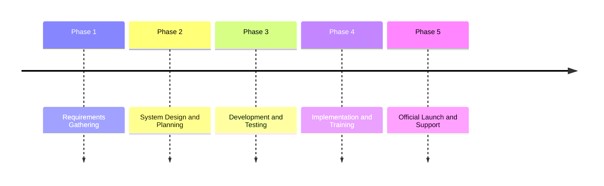

# Open Campus Solution

> [!WARNING]
> 🚧 WIP Drafts
>
> Please be patient as we make progress.

## Documentation

For developers, see [documentations](./docs/index.md).

## Introduction

This project aims to develop and implement a comprehensive Digital Campus solution to enhance the educational experience through advanced technology integration. The solution will include digital classrooms, online learning platforms, administrative automation, and enhanced communication tools.

### Objectives

- **Enhance Learning Experience**: Implement digital tools to facilitate interactive and engaging learning.
- **Improve Administrative Efficiency**: Automate administrative processes to reduce manual workload and errors.
- **Strengthen Communication**: Develop platforms for seamless communication between students, faculty, and administration.
- **Data-Driven Decision Making**: Utilize data analytics to inform educational strategies and policies.

See roadmaps (ryuujo1573/OpenCampus#1).

### Timeline

### Code of Goal

This idea is suggested with the following goals:

1. To introduce a patent-free, open-source solution;
2. To abstract complex business logics;
3. To scale with institution size;
4. To support schools in conserving their funds;

### Future plans

**Open source and easy to access.**

Introducing a free, open-source solution to education can democratize access to resources and foster innovation.

Implementing suitable abstractions during design will help tackle complex business challenges effectively.

Prioritizing open-source over profit-driven models can create a more inclusive and sustainable ecosystem, benefiting a broader audience and encouraging community-driven development.

Community managed development, with the vast on campus students who are interested in improving shared experiences and/or practicing team-collaboration and large-scale application development, is highly appreciated.

## Contributing

`todo()`

## Acknowledgement

`todo()`
