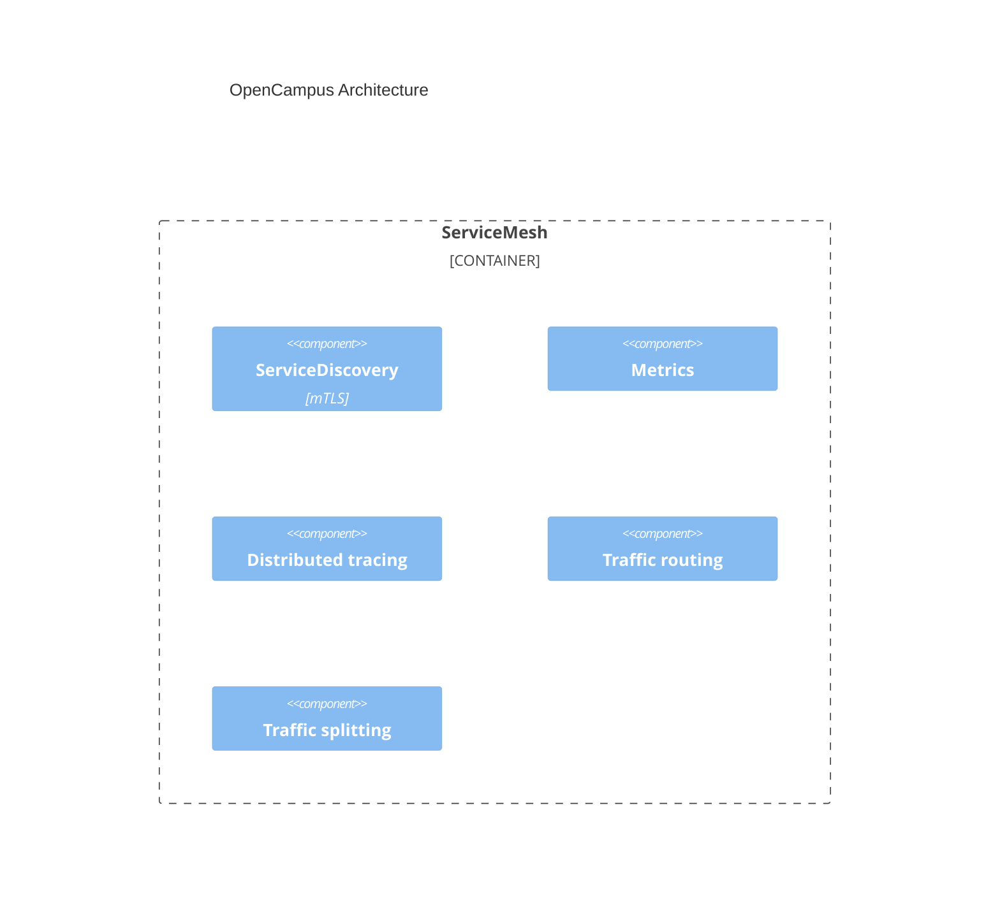

# OpenCampus - Architecture

To achieve a high level of flexibility and robusticity, we need to concentrate on how each individual module works (within each business domain), and keep interactions across the borders clear and simple.

We decide to introduce `Dapr`, a great distributed systems open-source solution, providing a runtime platform for building resilient microservices.

More interesting facts about `Dapr` is that it helps us build elastic & stateful/stateless applications, without paying much efforts in porting these apps to different physical platforms, i.e. cloud computing, edge computing etc.. Also, we do not have to enforce to use specific language and its ecosystem, for `Dapr` is born polyglotism.

## Development architecture

1. Use CI/CD to simplify upgrades on running instances.
2. Use control plane strategy to manage and collect telemetry data etc..
3. Use dev dashboard to obtain useful information.

### Dashborad

1. Performance
2. Microservice observation
3. Log and metrics
4. Administrative tools
5. System configurations
6. Deployments
7. Alerts

### Overall architecture

